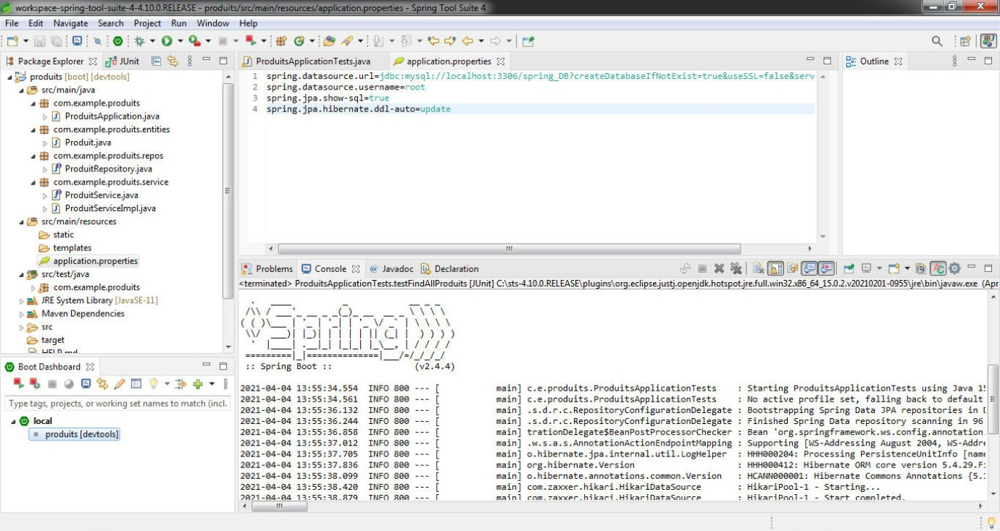
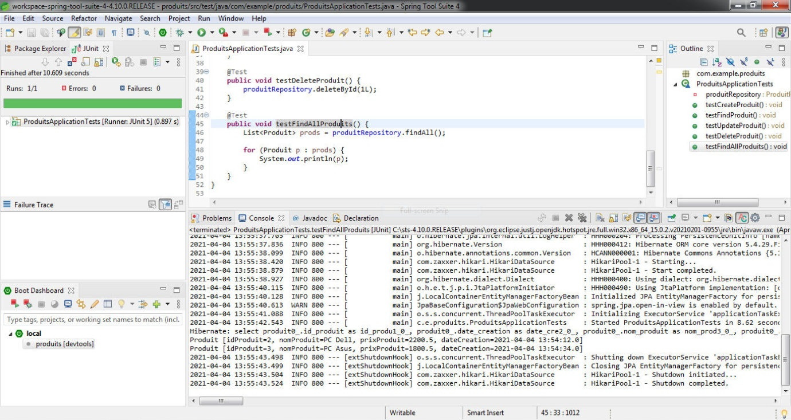

# Spring boot 2 Demo
## **Workshop 1**: Model, persistence & service layers

This workshop has the following objectives:

 1. Creating the project.
 2. Creating `Product` entity & its interface.
 3. Configuring the `application.properties` file.
 4. Testing **CRUD** operations on the created entity.
 5. Creating the `Service` layer.

*Configuring `application.properties`*

*Testing **CRUD** operations*
